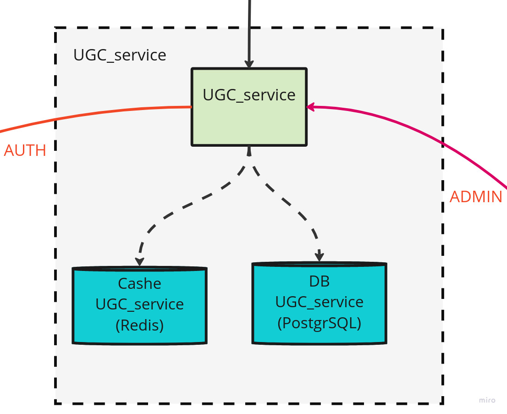

# Описание проекта "UGC service"

---


"UGC сервис" - это микросервис платформы отвечающий за создание, управление и редактирование заявок как пользователем так и модератором сервиса.





## Ссылки

[Swagger на checkbrandcom.site](https://checkbrandcom.site/ugc_service/swagger)

[Swagger локальный ](http://localhost/ugc_service/swagger)


## Функциональность

Микросервис предоставляет следующие функции:

- Создание, получение заявки для определенной коллекции
- Получение всех заявок пользователя
- Редактирование, скрытие заявок 
- Бронирование токена через заявку
- Получение для коллекции всех заявок с забронированными токенами
- Добавление в вайт лист
- Изменение статуса при минте

## Технологии

Сайт создан с использованием следующих технологий:

- Python FastAPI для бэкенда
- Postgres для хранения данных
- Redis для кеширования (пока не используется)
- Docker Compose для управления контейнерами
- Makefile для автоматизации сборки и запуска проекта

## Установка

Для установки проекта для разработки необходимо выполнить следующие шаги:

1. Клонировать репозиторий на свой компьютер:

```
git clone https://gitlab.com/dry.wats/CheckBrand.git
```

2. Установить зависимости:

В [ugc.example.env](ugc.example.env) При необходимости внести изменения

3. Запустить сервер:

```
make ugc_full_run
```

## Описание переменных

- `UGC_SUFFIX_NAME` - суффикс имени, который добавляется к именам сервисов и хостов. Значение по умолчанию - "Dev".


- `UGC_SERVICE_DEBUG` - флаг, указывающий, включен ли режим отладки для сервиса. Значение по умолчанию - "True".


- `UGC_DB_USER` - имя пользователя базы данных.
- `UGC_DB_PASSWORD` - пароль пользователя базы данных.
- `UGC_DB_NAME` - имя базы данных.
- `UGC_DB_HOST` - хост базы данных. Если используется Docker Compose, то значение должно быть в формате `${SERVICE_NAME}`.
- `UGC_DB_PORT` - порт базы данных.


- `UGC_REDIS_HOST` - хост Redis. Если используется Docker Compose, то значение должно быть в формате `${SERVICE_NAME}`.
- `UGC_REDIS_PORT` - порт Redis.
- `UGC_REDIS_PASSWORD` - пароль Redis.


- `ADMIN_PROTOCOL` - протокол, используемый для связи с панелью администратора.
- `ADMIN_HOST` - хост панели администратора. Если используется Docker Compose, то значение должно быть в формате `${SERVICE_NAME}`.
- `ADMIN_PORT` - порт панели администратора.
- `ADMIN_GRPC_HOST` - хост сервиса администрирования для gRPC. Если используется Docker Compose, то значение должно быть в формате `${SERVICE_NAME}`.
- `ADMIN_GRPC_PORT` - порт сервиса администрирования для gRPC.


- `AUTH_GRPC_HOST` - хост сервиса аутентификации для gRPC. Если используется Docker Compose, то значение должно быть в формате `${SERVICE_NAME}`.
- `AUTH_GRPC_PORT` - порт сервиса аутентификации для gRPC.


- `NOTIFICATION_GRPC_HOST` - хост сервиса уведомлений для gRPC. Если используется Docker Compose, то значение должно быть в формате `${SERVICE_NAME}`.
- `NOTIFICATION_GRPC_PORT` - порт сервиса уведомлений для gRPC.


- `UGC_GRPC_HOST` - хост сервиса UGC для gRPC. Если используется Docker Compose, то значение должно быть в формате `${SERVICE_NAME}`.
- `UGC_GRPC_PORT` - порт сервиса UGC для gRPC.

## Использование

Для использования большей части функционала должны работать основные микросервисы 

#### Такие, как:
- AUTH
- Admin
- Notification

---

## Тестирование

Для тестирования проекта необходимо выполнить следующие команды:

```
make tdev_ugc_test
```

---

## Автор

Сервис создан Автором MWTech@mail.ru.